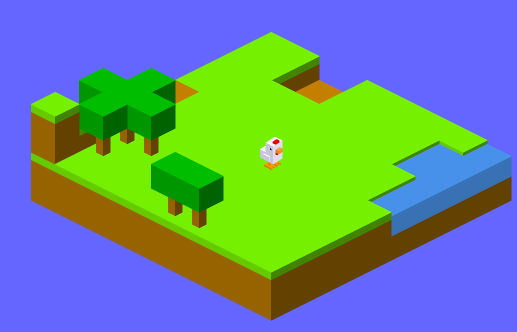

# crossy-craft

This is an isometric perspective, voxel based game engine. It uses Crossy Road style graphics with a Minecraft-like map.

'W', 'A', 'S', 'D' to move around
'J' to delete a voxel

The map is procedurally generated using modified cellular automata.

Don't fall off the map!
